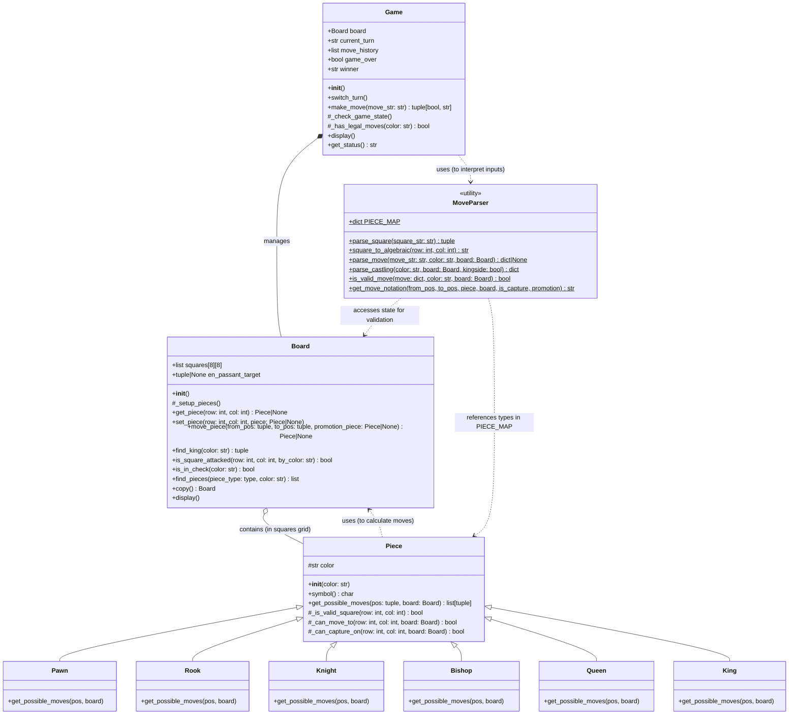

# Console chess class diagram

Here is the class diagram for the project:

```mermaid
classDiagram
    direction TB

    %%================ Main Classes ================

    class Game {
        +Board board
        +str current_turn
        +list move_history
        +bool game_over
        +str winner
        +__init__()
        +switch_turn()
        +make_move(move_str: str) tuple[bool, str]
        #_check_game_state()
        #_has_legal_moves(color: str) bool
        +display()
        +get_status() str
    }

    class Board {
        +list squares[8][8]
        +tuple|None en_passant_target
        +__init__()
        #_setup_pieces()
        +get_piece(row: int, col: int) Piece|None
        +set_piece(row: int, col: int, piece: Piece|None)
        +move_piece(from_pos: tuple, to_pos: tuple, promotion_piece: Piece|None) Piece|None
        +find_king(color: str) tuple
        +is_square_attacked(row: int, col: int, by_color: str) bool
        +is_in_check(color: str) bool
        +find_pieces(piece_type: type, color: str) list
        +copy() Board
        +display()
    }

    class Piece {
        #str color
        +__init__(color: str)
        +symbol() char
        +get_possible_moves(pos: tuple, board: Board) list[tuple]
        #_is_valid_square(row: int, col: int) bool
        #_can_move_to(row: int, col: int, board: Board) bool
        #_can_capture_on(row: int, col: int, board: Board) bool
    }

    %% Utility Class for Move Parsing (represented as a class with static members)
    class MoveParser {
        <<utility>>
        +dict PIECE_MAP$
        +parse_square(square_str: str)$ tuple
        +square_to_algebraic(row: int, col: int)$ str
        +parse_move(move_str: str, color: str, board: Board)$ dict|None
        +parse_castling(color: str, board: Board, kingside: bool)$ dict
        +is_valid_move(move: dict, color: str, board: Board)$ bool
        +get_move_notation(from_pos, to_pos, piece, board, is_capture, promotion)$ str
    }

    %%================ Piece Subclasses ================
    %% Methods are inherited, only showing overrides if necessary based on docs
    class Pawn {
        +get_possible_moves(pos, board)
    }
    class Rook {
        +get_possible_moves(pos, board)
    }
    class Knight {
        +get_possible_moves(pos, board)
    }
    class Bishop {
        +get_possible_moves(pos, board)
    }
    class Queen {
        +get_possible_moves(pos, board)
    }
    class King {
        +get_possible_moves(pos, board)
    }

    %%================ Relationships ================

    %% Inheritance
    Piece <|-- Pawn
    Piece <|-- Rook
    Piece <|-- Knight
    Piece <|-- Bishop
    Piece <|-- Queen
    Piece <|-- King

    %% Composition/Aggregation
    Game *-- Board : manages
    Board o-- Piece : contains (in squares grid)

    %% Dependencies
    Piece ..> Board : uses (to calculate moves)
    Game ..> MoveParser : uses (to interpret inputs)
    MoveParser ..> Board : accesses state for validation
    MoveParser ..> Piece : references types in PIECE_MAP
```