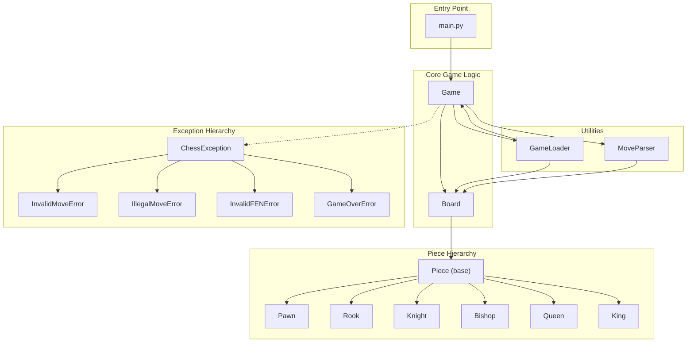

# Console Chess - Class Interaction Overview

## Project Structure

```
ConsoleChess/
├── main.py          → Entry point
├── game.py          → Game logic & UI
├── board.py         → Board state management
├── pieces.py        → Piece classes & movement
├── move_parser.py   → Algebraic notation parsing
├── game_loader.py   → FEN notation support
└── exceptions.py    → Custom exceptions
```

---

## Class Interaction Diagram



---

## How Classes Interact

### 1. Game Flow

```
┌─────────────────────────────────────────────────────────────────┐
│  User Input: "Nf3"                                              │
└─────────────────────────────────────────────────────────────────┘
                              │
                              ▼
┌─────────────────────────────────────────────────────────────────┐
│  Game.make_move("Nf3")                                          │
│  ├── Calls MoveParser.parse_move()                              │
│  │   ├── Finds Knight pieces on board                           │
│  │   ├── Checks which can reach f3                              │
│  │   └── Returns: {from: (7,6), to: (5,5), promotion: None}     │
│  ├── Calls MoveParser.is_valid_move()                           │
│  │   ├── Creates Board.copy()                                   │
│  │   ├── Simulates move                                         │
│  │   └── Checks if king is in check                             │
│  └── Calls Board.move_piece()                                   │
│      └── Updates squares, handles special moves                 │
└─────────────────────────────────────────────────────────────────┘
```

### 2. Piece Movement (Polymorphism)

```
Board.get_piece(row, col)  →  Returns Piece reference
         │
         ▼
piece.get_possible_moves(pos, board)
         │
         ├── If Pawn:   Forward moves + diagonal captures + en passant
         ├── If Rook:   Horizontal + vertical lines
         ├── If Knight: L-shaped jumps
         ├── If Bishop: Diagonal lines
         ├── If Queen:  Rook + Bishop combined
         └── If King:   One square any direction + castling
```

### 3. FEN Loading

```
┌─────────────────────────────────────────────────────────────────┐
│  GameLoader.load_fen("r1bk3r/p2pBpNp/...")                      │
│  ├── Splits FEN into parts                                      │
│  ├── _parse_position() → Creates Board with pieces              │
│  ├── Parses active color → Sets current_turn                    │
│  ├── _apply_castling_rights() → Marks king/rook has_moved       │
│  ├── Parses en passant target                                   │
│  └── Returns configured Game object                             │
└─────────────────────────────────────────────────────────────────┘
```

---

## Class Responsibilities

| Class | Responsibility |
|-------|---------------|
| **Game** | Turn management, move execution, game state (check/mate/stalemate) |
| **Board** | 8x8 grid storage, piece placement, check detection, board copying |
| **Piece** | Base interface, common validation helpers |
| **Pawn/Rook/...** | Piece-specific movement rules |
| **MoveParser** | Algebraic notation ↔ internal coordinates |
| **GameLoader** | FEN notation ↔ Game state |
| **Exceptions** | Structured error handling |

---

## Exception Flow

```
User enters invalid move
         │
         ▼
┌─────────────────────┐
│ Game.make_move()    │
│ raise_exceptions=T  │
└─────────────────────┘
         │
         ├── Cannot parse → raise InvalidMoveError
         ├── Leaves king in check → raise IllegalMoveError
         ├── Game already over → raise GameOverError
         │
         ▼
┌─────────────────────┐
│ Caught by caller    │
│ or play_game() loop │
└─────────────────────┘
```

---

## Example: Complete Move Sequence

```python
# User plays "e4" as white

1. Game receives "e4"
   │
2. MoveParser.parse_move("e4", "white", board)
   ├── No piece letter → Pawn move
   ├── Target: e4 → (4, 4) in internal coords
   ├── Find white pawns that can reach (4, 4)
   └── Returns: {from: (6, 4), to: (4, 4)}
   │
3. MoveParser.is_valid_move(move, "white", board)
   ├── board.copy() → test_board
   ├── test_board.move_piece((6,4), (4,4))
   └── test_board.is_in_check("white") → False ✓
   │
4. Board.move_piece((6,4), (4,4))
   ├── Pawn moved 2 squares → set en_passant_target = (5, 4)
   ├── piece.has_moved = True
   └── Returns: None (no capture)
   │
5. Game.switch_turn() → current_turn = "black"
   │
6. Game._check_game_state()
   └── Returns: "" (no check/mate)
```

---

## Class Count Summary

| Category | Classes | Count |
|----------|---------|-------|
| Core | Game, Board | 2 |
| Pieces | Piece, Pawn, Rook, Knight, Bishop, Queen, King | 7 |
| Utilities | GameLoader | 1 |
| Exceptions | ChessException, InvalidMoveError, IllegalMoveError, InvalidFENError, GameOverError | 5 |
| **Total** | | **15** |

✅ Exceeds requirement of 10 classes
